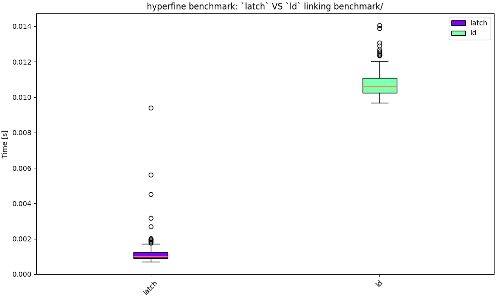

<h1 align="center"><code>latch</code></h1>

<p align="center"><b>A fast <a href="https://en.wikipedia.org/wiki/Linker_(computing)#Static_linking">static linker</a> to produce 64 bit <a href="https://en.wikipedia.org/wiki/Executable_and_Linkable_Format">ELF</a> executables</b></p>

> [!IMPORTANT]  
> This is a **toy** project. [ELF](https://en.wikipedia.org/wiki/Executable_and_Linkable_Format) is quite an extensive format and only a small subset is supported.


## Demo

An example of compiling some C files into object files which are then linked.

Source files in `demo/`

```
$ gcc -c main_area_calculator.c -o  main_area_calculator.o
$ gcc -c calculate_area.c -o  calculate_area.o
$ gcc -c utils.c -o  utils.o

$ latch -o area_calculator main_area_calculator.o utils.o calculate_area.o

$ ./area_calculator
Rectangle 5x10, Calculated Area: 50

$ readelf -a --wide area_calculator                                                         
ELF Header:
  Magic:   7f 45 4c 46 02 01 01 00 00 00 00 00 00 00 00 00 
  Class:                             ELF64
  Data:                              2's complement, little endian
  Version:                           1 (current)
  OS/ABI:                            UNIX - System V
  ABI Version:                       0
  Type:                              EXEC (Executable file)
  Machine:                           Advanced Micro Devices X86-64
  Version:                           0x1
  Entry point address:               0x401000
  Start of program headers:          64 (bytes into file)
  Start of section headers:          8249 (bytes into file)
  Flags:                             0x0
  Size of this header:               64 (bytes)
  Size of program headers:           56 (bytes)
  Number of program headers:         4
  Size of section headers:           64 (bytes)
  Number of section headers:         4
  Section header string table index: 3

Section Headers:
  [Nr] Name              Type            Address          Off    Size   ES Flg Lk Inf Al
  [ 0]                   NULL            0000000000000000 000000 000000 00      0   0  0
  [ 1] .text             PROGBITS        0000000000401000 001000 000190 00  AX  0   0  1
  [ 2] .data             PROGBITS        0000000000402000 002000 000022 00  WA  0   0  1
  [ 3] .shstrtab         STRTAB          0000000000000000 002022 000017 00      0   0  1

Key to Flags: ...

There are no section groups in this file.

Program Headers:
  Type           Offset   VirtAddr           PhysAddr           FileSiz  MemSiz   Flg Align
  LOAD           0x000000 0x0000000000400000 0x0000000000400000 0x000120 0x000120 R   0x1000
  LOAD           0x001000 0x0000000000401000 0x0000000000401000 0x000190 0x000190 R E 0x1000
  LOAD           0x002000 0x0000000000402000 0x0000000000402000 0x000022 0x000022 R   0x1000
  GNU_STACK      0x000000 0x0000000000000000 0x0000000000000000 0x000000 0x000000 RW  0x10

 Section to Segment mapping:
  Segment Sections...
   00     
   01     .text 
   02     .data 
   03     

There is no dynamic section in this file.

There are no relocations in this file.
No processor specific unwind information to decode

No version information found in this file.

```

## Benchmark against `ld`

This isn't exactly fair since `ld` has to consider a much more comprehensive feature-set.

But just for fun, I ran a benchmark of linking the 100+ generated C files in `benchmark/`.

In this specific case it took on average `latch` 1.2 ms and `ld` 10.8 ms.



Preformed on my `Lenovo ThinkPad X1 Carbon Gen 8, 16.0 GiB, Intel® Core™ i5-10210U × 8`

# License

This project is licensed under the MIT License - see the [LICENSE](LICENSE) file for details.